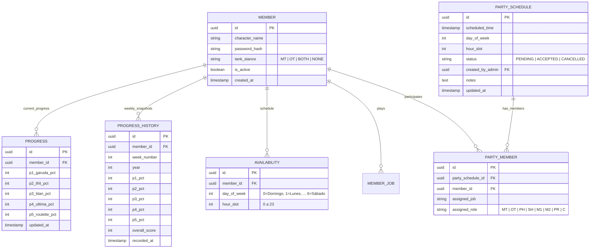

# Plan de Implementación: UWU Tracker - Lux Obscura (FFXIV) [Fase de Planeación]

Aplicación web con diseño onírico para la Free Company **Lux Obscura** (Final Fantasy XIV), creada para monitorear el progreso actual e histórico en **The Weapon's Refrain (Ultimate) / UWU**, gestionar disponibilidades semanales, explorar todas las combinaciones de party viables y permitir al Administrador programar y oficializar las incursiones.

---

## 1. Nuevos Requerimientos y Reglas de Negocio

### A. Registro Histórico Semanal (Evolución en el Tiempo)
- **Historial por Semana**:
  - Se registrará un historial semanal (Semana 1, Semana 2, etc., o por fecha de semana de raid de FFXIV, los martes de reset).
  - Permite a cada miembro ver su propia curva de progreso en las 5 fases semana a semana.
  - **Progreso Global de la FC**: Visualización agregada para que todos los miembros vean cómo avanza la Free Company en conjunto (ej. % promedio de avance, miembros que llegaron a Titan, Ultima Weapon o Enrage en cada semana).
  - Gráfica onírica temporal (con líneas de éter luminoso) que muestra la progresión de los integrantes.

### B. Gestión y Aprobación de Parties (Admin vs Miembros)
- **Visor del Administrador**:
  - En cada franja horaria donde haya quórum (mínimo 1 hora de coincidencia), el Admin podrá ver **todas las combinaciones posibles de party**, no solo la de mayor prioridad.
  - La party con **Prioridad de Menor Progreso** aparecerá destacada como la recomendada para evitar estancamientos.
  - El Admin tiene la facultad de **"Aceptar / Oficializar Party"**:
    - Puede seleccionar cuál combinación de party se llevará a cabo.
    - Al confirmar una party, esta queda agendada oficialmente en el calendario con estado `CONFIRMADA`.
- **Visor de los Miembros**:
  - **Parties Aceptadas / Oficiales**: Pestaña o sección destacada donde cualquier miembro puede ver las incursiones ya aprobadas por el Admin (día, hora, 8 integrantes confirmados y sus respectivos jobs).
  - **Parties Potenciales / Disponibles**: Vista informativa donde pueden ver en qué otros horarios hay coincidencia completa de 8 roles para entusiasmar al equipo a abrir nuevas fechas.

### C. Composición Estricta de Party (8 Jugadores Sin Jobs Duplicados)
1. **1 Main Tank (MT)**: Paladin, Warrior, Dark Knight o Gunbreaker (con preferencia MT o Ambos).
2. **1 Off Tank (OT)**: Paladin, Warrior, Dark Knight o Gunbreaker (con preferencia OT o Ambos). *MT y OT deben ser jobs distintos.*
3. **1 Pure Healer (PH)**: White Mage o Astrologian.
4. **1 Shield Healer (SH)**: Scholar o Sage.
5. **2 Melee DPS (M1, M2)**: Monk, Dragoon, Ninja, Samurai, Reaper, Viper (*dos jobs Melee distintos*).
6. **1 Physical Ranged DPS (PR)**: Bard, Machinist o Dancer.
7. **1 Magical Ranged DPS (Caster)**: Black Mage, Summoner, Red Mage o Pictomancer.

> [!IMPORTANT]
> **Regla de Lenguaje Estricta**: Queda terminantemente prohibido usar las palabras *"banca"* o *"reserva"* para referirse a los jugadores. Se usarán términos respetuosos y positivos como *"Compañeros listos para rotar"*, *"Disponibles para futuras incursiones"* o simplemente listarlos como miembros disponibles.

### D. Autoregistro y Credenciales Simples
- **Miembros**: Autoregistro libre con Nombre de Personaje y contraseña simple (almacenada con hash `bcrypt`). Permite editar su perfil, Main Job, Flex Jobs opcionales, postura de Tank (MT/OT/Ambos), progreso de las 5 fases y disponibilidad semanal.
- **Admin**: Acceso con usuario y contraseña hasheada para gestión general, reseteo de claves y oficialización de parties.

### E. Disponibilidad y Zonas Horarias
- Cuadrícula interactiva de 24 horas x 7 días.
- Coincidencia mínima requerida para formar party: **1 hora**.
- Horario de referencia por defecto: **Ciudad de México (America/Mexico_City / CST)**, con selector dinámico para convertir a cualquier zona horaria (UTC/Server Time, EST, PST, etc.).

---

## 2. Experiencia de Usuario y Navegación

La aplicación se estructurará en 4 vistas principales bajo la estética **onírica**:

1. **El Nexo (Dashboard Principal)**:
   - Banner de Lux Obscura con partículas de éter flotantes y niebla astral.
   - Próximas **Parties Oficiales Aceptadas** (cuenta regresiva, día, hora, los 8 miembros y sus jobs).
   - Resumen del progreso general de la FC en Ultima Weapon Ultimate.
   - Tabla interactiva de miembros con su fase actual, porcentaje y jobs.
2. **Evolución Histórica (Línea de Tiempo)**:
   - Filtro por semana o miembro.
   - Gráfica de avance histórico personal y global de la FC semana a semana.
   - Registro de hitos (ej. "Semana 3: Primera party que alcanza Supresión").
3. **Disponibilidad & Creador de Party**:
   - Matriz interactiva de disponibilidad individual.
   - Visor de **Parties Disponibles**: muestra los bloques donde se puede formar party.
   - Si eres Admin: botón para explorar todas las combinaciones posibles en esa hora y botón de un clic para **"Aceptar y Notificar Party"**.
4. **Perfil de Miembro**:
   - Sliders o inputs con estética de cristales de éter para las 5 fases de UWU (Garuda, Ifrit, Titan, Ultima, Enrage: 0% a 100% cada una).
   - Selección de Main Job y Flex Jobs opcionales.
   - Selector de Stance si juega Tank (MT / OT / Ambos).

---

## 3. Modelo de Datos PostgreSQL (Supabase)

---

## 4. Algoritmo de Detección de Parties

Para cada franja de 1 hora en la semana:
1. Filtrar los miembros que marcaron disponibilidad en ese día y hora.
2. Identificar candidatos para cada uno de los 7 slots obligatorios:
   - MT (Tanks con opción MT/Both)
   - OT (Tanks con opción OT/Both, con job != MT)
   - PH (WHM, AST)
   - SH (SCH, SGE)
   - M1, M2 (Melees con jobs distintos)
   - PR (BRD, MCH, DNC)
   - C (BLM, SMN, RDM, PCT)
3. Generar **todas las combinaciones viables sin repetición de miembros ni jobs**.
4. Calcular la **puntuación de prioridad de cada combinación**:
   - **Criterio 1 (Menor Progreso)**: Mayor prioridad a la party cuyos miembros tengan menor avance en UWU, garantizando apoyo a quienes van más rezagados para evitar estancamientos.
   - **Criterio 2 (Más Main Jobs)**: Ante igualdad de progreso, priorizar combinaciones que utilicen más **Main Jobs** frente a Flex Jobs.
   - Las combinaciones de party son únicas (sin duplicar la misma composición). Un mismo jugador puede figurar como opción en distintas combinaciones viables para que el Admin elija la mejor.
5. Exponer:
   - Para el Admin: **Lista de combinaciones ordenadas por prioridad (menor progreso + más main jobs)**, con control para definir la hora de inicio, notas y botón directo para **"Aceptar Party"**, además de la función para **"Cerrar Semana y Guardar Histórico"** (Opción A).
   - Para los Miembros:
     - **Banner Astral de Próxima Incursión Aceptada**: Tarjeta destacada al ingresar con cuenta regresiva, compañeros convocados y jobs asignados.
     - Resumen de horarios con quórum y lista de parties confirmadas.

---

## 5. Preguntas de Planificación para Continuar

Para seguir puliendo la planeación antes de programar:

1. **Captura del Historial Semanal**:
   - ¿Cómo prefieres que se guarde el historial por semana?
     - *Opción A (Automática/Snapshot semanal)*: Un botón en el panel de admin que diga "Cerrar semana y guardar foto histórica" (o automático cada martes tras el reset de FFXIV).
     - *Opción B (Continuo)*: Cada vez que un miembro actualiza su progreso, si ya cambió de semana, se archiva el estado de la semana anterior.
2. **Duración de las Parties Oficiales**:
   - Cuando el Admin marca una party aceptada en un horario (ej. Viernes a las 21:00), ¿la party es típicamente de 1 hora, 2 horas, o el Admin puede definir la duración del bloque (ej. de 21:00 a 23:00)?
3. **Notificación o Alerta Visual**:
   - ¿Te gustaría que los miembros vean un indicador tipo "Tienes una party aceptada próxima" con sus compañeros y jobs en la pantalla principal?

